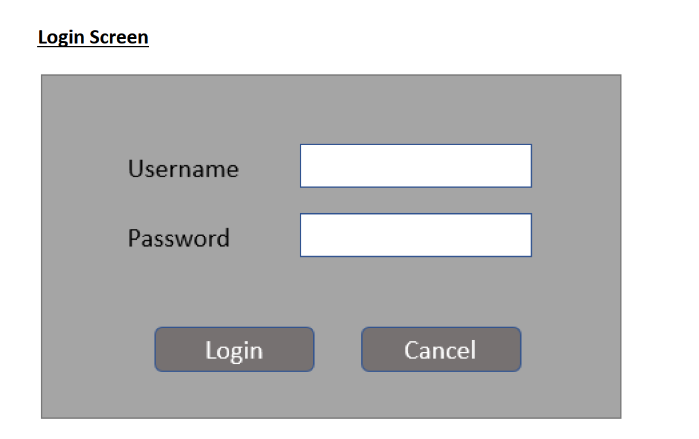
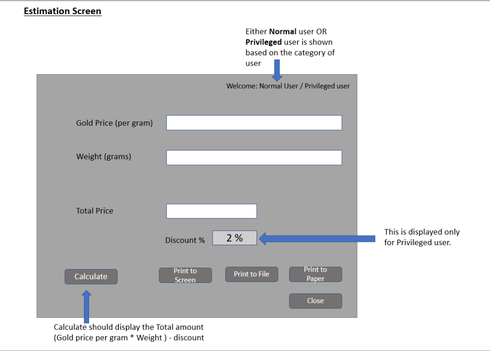

# jewelry-store-challenge
The assignment will consist of two parts:  
• Frontend in React/Angular  
• Backend in ASP.NET Core and Database can be local DB / In memory 

Requirement:      
We require a small estimation web application for a tiny Jewelry store.    
The application has the following abilities to cater the service   
1.   Login screen to login to the application. We have 2 categories of customers (Regular and   
Privileged)   

 

2.   Screen should have option to enter    
a.   Gold price   
b.   Weight of the item   
c.   Discount percentage (This option should be visible only for privileged customer and default   
discount is 2%. Please remember that store owner can apply any kind of discount plans in   
future but for now only 2% for privileged user)   

 

3.   The application should be able to print via these options   
a.   On the screen (Show in a message pop up.)   
b.   To a file (Download a PDF file)   
c.   To a paper via printer (Option to be provided but implementation should be kept dummy   
which means method implementation should throw not implemented exception)   

 

Note:    
1.   No need for any registration of user. By default, you can store two users one as Normal and   
the other as Privileged user in the database. Use entity framework to fetch the data from 
database.  
2.   Discount is only applicable for Privileged user   

 

Expectations:   
* Both the frontend and backend must have unit tests. 
* The front-end application must invoke the backend APIs to do CRUD operations (applicable for login as 
well) 
* Please use best practices everywhere 

<b> Note: In case you are only comfortable with asp.net core, please create a REST API with different endpoint, write postman testcases to simulate the workflow.</b>

Below are the suggested screens for your reference. Please feel free to create new UI/UX based on your preference.

## :arrow_down: 

